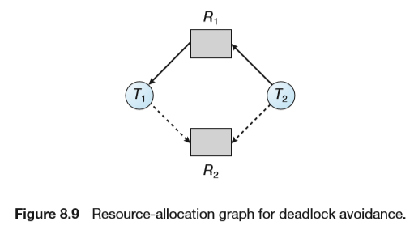
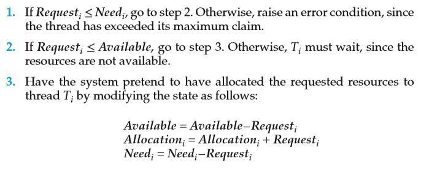

# Deadlocks

## System Model

- Resource
- Instances

系统含有若干资源，每个资源有若干个实例（代表同一个资源同时能被多少进程调用），每个进程使用资源需要按如下顺序

- Request
- Use
- Release

## Deadlock in Multithreaded Applications

```c
/* thread one runs in this function */ 
void *do_work_one(void *param)
{
    pthread_mutex_lock(&first_mutex);
    pthread_mutex_lock(&second_mutex); 
    /** 
    * Do some work 
    */
    pthread_mutex_unlock(&second_mutex);
    pthread_mutex_unlock(&first_mutex);
    pthread_exit(0);
} 
/* thread two runs in this function */
void *do_work_two(void *param)
{
    pthread_mutex_lock(&second_mutex);
    pthread_mutex_lock(&first_mutex); 
    /**
    * Do some work 
    */
    pthread_mutex_unlock(&first_mutex);
    pthread_mutex_unlock(&second_mutex);
    pthread_exit(0);
}
```

## Deadlock Characterization

### Necessary Conditions

- Mutual exclusion
- Hold and wait
- No preemption，非抢占
- Cicular wait，进程之间相互依赖

### Resource-Allocation Graph

- T：Thread
- R：Resource
- E
  - T->R：Request Edge
  - R->T：Assignment  Edge

无环肯定无死锁

有环可能有死锁

## Methods for Handling Deadlocks

### Deadlock Prevention

让四个`Necessary Conditions`其一不可能存在

#### Mutual Exclusion

必须存在

#### Hold and Wait

- 只有在拿到所有必须资源时才开始
- 只有做完所有任务才释放
- 资源利用率低

#### No Preemption

允许抢占

#### Circular Wait

按合理的顺序加锁

问题：在动态程序在加锁的顺序不能保证

### Deadlock Avoidance

需要额外信息以合理分配资源

#### Safe State

Safe State：不可能产生死锁

对于一个进程序列，如果后一个进程可以在前一个进程完成后结束等待，则这个进程序列是安全的

进程需要提供需要最多资源的数量

#### Resource-Allocation-Graph Algorithm 

新加入`claim edge`，用虚线表示，确保不会成环时才分配资源



#### Banker's Algorithm

先提供资源给可以完成任务的进程

变量定义：
- n：进程数量
- m：资源类型的种类
- Avaliable：可提供资源量
- Max：需要的最大资源数
- Allocation：已分配资源
- Need：还需要的资源量（$Max-Allocation$）

##### Safety Algorithm

1. 令Work和Finish为长度m和n的向量，初始化Work=Avaliable，Finish均为False
2. 寻找Need≤Work且没有完成的进程，并分配相应的资源，若找不到，到第四步
3. 更新Work，标记任务结束，返回到第二步
4. 若所有任务都可以完成，则系统处于安全状态

##### Resource-Request Algorithm

$Request_i[j]=k$表示进程$T_i$需要k个$R_j$资源

每个`Request`在分配资源前要确保系统处于安全状态，之后才能分配资源



如果新状态不安全，则进程应该等待并恢复到原来的资源分配状态

## Deadlock Detection

