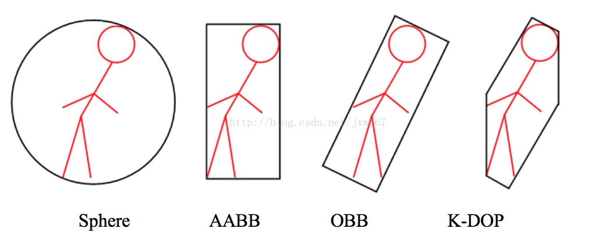

## 面向凸体的碰撞检测

### 基于特征的碰撞检测

判断两个多面体的顶点、边、面之间的相互关系

#### Lin-Canny算法

求解两个凸包几何体间的最近距离（或最近点对等）

将几何体拆分成基本的几何体元对：点点、点边、点面、边边、边面、面面

##### Voronoi区域（VA）

假设平面上有点集合S，a为其中一个点，则Voronoi区域定义如下：

> 离点a的距离比离S中其他点的距离都要近的平面上的点集合

##### 对几何体元对的处理

- 点点：判断是否是最近点对。如果A、B组成最近点对，则A在B的VA中，B在A的VA中
- 点边：求点与线的最近点，接着进行VA检验（相当于点点）
- 点面：求点与面的最近点，接着进行VA检验（相当于点点）
- 边边：求解出边边间的最近点对，然后做VA检验
- 边面：求解出边面间的最近点对，边投影到面上，转换为边边的判断
- 面面：先判断是否平行，若两个面不平行或是平行而无重叠，则求出两个面之间的最近边对

### 基于单纯形的碰撞检测

#### 基础概念

- 单纯形（Simplex）：点（0-Simplex）、线段、三角形或四面体
- 支持点：对一个多边形，给定方向上最远的点
- 闵可夫斯基和（差）：物体1上的所有点和物体2上的所有点的坐标和（差）集
  - 如果两个物体重叠或者相交，它们的闵可夫斯基差肯定包含原点

#### GJK算点

只需要知道闵可夫斯基差是否包含原点就可以知道两个物体是否相交

在闵可夫斯基差形成的物体内迭代的形成一个单纯形，并使这个单纯形尽量包含原点

### 基于层次包围盒的碰撞检测

- 包围球
- AABB
- OBB
- k-DOP

 

#### 包围球

找到最大最小的xyz

球心=$\frac12(x_{max} + x_{min}),\frac12(y_{max} + y_{min}),\frac12(z_{max} + z_{min})$

半径=$\frac12\sqrt{(x_{max}-x_{min})^2+(y_{max}-y_{min})^2+(z_{max}-z_{min})^2}$

两球心距离小于等于半径之和即碰撞

适用于检测精度不高的运动环境

#### AABB

包含碰撞体且边平行于坐标轴的最小六面体

AABB盒的顶点由最大最小值校验

碰撞检测：沿坐标轴做投影，只有在坐标轴都发生重叠，两个物体才意味着发生了碰撞

碰撞检测算法计算简单，速度快，但只用于精度不好的运动寒假

#### OBB

该对象且向相对于坐标轴方向的任意最小长方体

二维包围盒的创建：基于PCA主成分分析法

**分离轴定理：**

如果能找到一个轴，两个凸多边形在轴上的投影不重叠，则这两个多边形不相交。如果这个轴不存在并且那些多边形是凹形的，则可以判碰撞

如果两个矩形之间存在分离线，则一定存在一条和两个矩形中的一条边平行的分离线

里面的法线（分离轴）是两条边的叉乘结果

- 碰撞精度高于AABB
- 算法复杂度高，内存消耗大

#### k-DOP

凸多面体，k代表面的个数，k越大，包围盒与物体的贴近程度越好，同时检测的耗费和节点修改的耗费也会相应增大

### 基于层次包围盒树的碰撞检测

暴力比较各物体与其他物体是否相交的比较次数为$N^2$

可以采用从粗到细的检测方法减少比较的次数