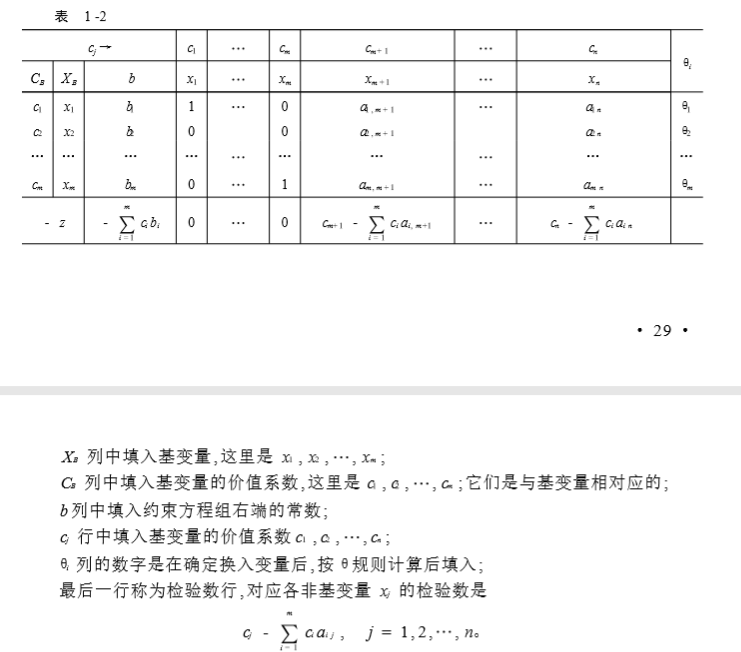
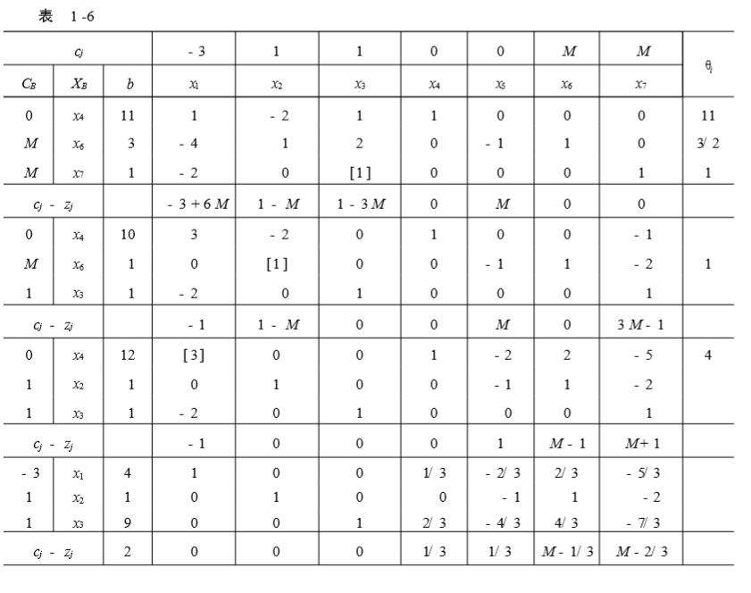
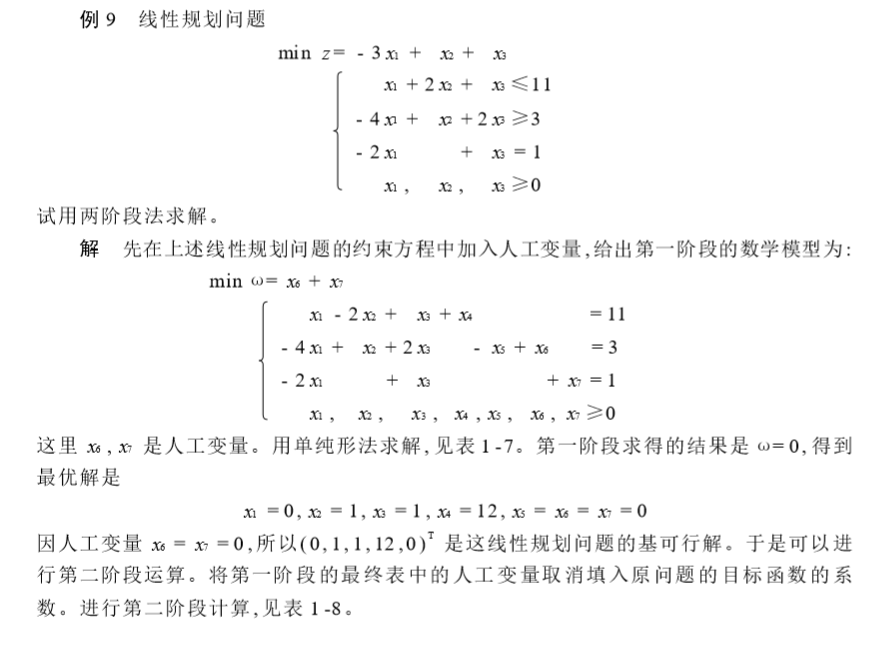
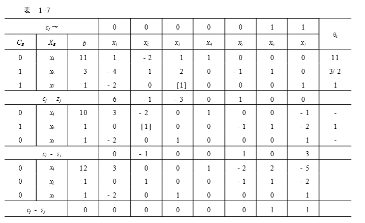
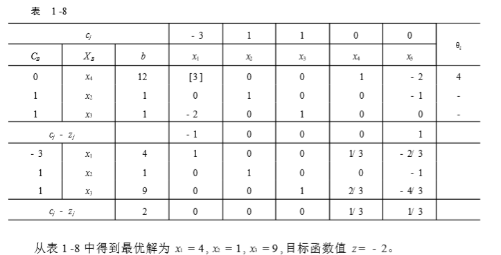

## 线性规划问题及其数学模型

### 线性规划问题的标准形式

$$
max\ z=CX\\
AX=b\\
X\geq0\\
\ \\
A-约束条件的m×n维系数矩阵，一般有m<n\\
b-资源向量\\
C-价值向量\\
X-决策变量向量
$$

标准形式的特性：

- 求目标函数的最大值（目标函数是求最大值，而不是最小值）
  - 加负号
- 约束条件中变量满足线性方程组与非负性两部分（约束条件中所有x是大于0的）
  - 添加松弛变量
  - 无约束变量可用两非负松弛变量的差替代
- 方程组中右端常数项皆非负（常数项b是非负的）
  - 加负号

#### 一些特殊情况

- 绝对值化为两个不等式，再化为两个等式
- 对于$a\le x\le b$
  - 增加两个约束$x\ge a$及$x\le b$
  - 令$x^{'}=x-a$，则$a\le x\le b$等价于$0\le x^{'}\le b-a$，增加一个约束$x^{'}\le b-a$然后将$x$用$x^{'}+a$代替

### 线性规划问题解的概念

- 可行解
- 最优解
- 基：A($m×n$维矩阵)中m阶非奇异子矩阵（$|B|\neq 0$）
- 基可行解：满足非负条件的基解
- 可行基
- 退化基解：有一个或多个基变量为0

## 线性规划问题的几何意义

- 凸集：对于集合内的每一对点，连接该对点的直线段上的每个点也在该集合内。

- 凸组合：指点的线性组合，要求所有系数都非负且和为 1。
- 顶点：设K为凸集，$X\in K$；若X不能用不同的两点$X^{(1)}\in K$和$X^{(2)}\in K$的线性组合表示为$X=\alpha X^{(1)}+（1-\alpha）X^{(2)}（0 < \alpha < 1）$，则称X为K的一个顶点

### 几个定理

- 若线性规划问题存在可行域，则其可行域为凸集
- 线性规划问题的基可行解X对应于可行域D的顶点
- 若可行域有界，线性规划问题的目标函数一定可以在其可行域的顶点上达到最优
- 若目标函数在多个顶点处达到最优值，则在这些顶点的凸组合上也达到最优值

## 单纯形法

基本思路：从可行域的一个顶点开始，转移到另一个顶点的迭代过程，转移的条件是使目标函数值得到改善

- 化标准型
- 寻找初始可行基，对于基变量算基本可行解及其对应目标函数值
- 分析两个基本表达式，看目标函数是否可以改善（非基变量系数全为负时则达到最优），可以改善时确定换入、换出变量进行迭代

例P28

### 迭代(旋转运算)

令$x_l$为换出变量，$x_k$为换出变量，变换的步骤为

- 将矩阵中第l行除以$a_{lk}$
- 将矩阵中$x_k$列的元素，除$a_{lk}$变换为1之外，其他变为0（利用第l行）

#### 例

$$
x_1\ \  x_2\ \  x_3\ \  x_4\ \  x_5\ \ \ \ b\ \ \ \\
\left[
    \begin{array}{ccccc|c}
      1 & 2 & 1 & 0 & 0 & 8\\
      4 & 0 & 0 & 1 & 0 & 16\\
      0 & 4 & 0 & 0 & 1 & 12
    \end{array}
\right]
$$

令$x_3,x_4,x_5$为基变量，$x_1,x_2$为非基变量，则一个基可行解为
$$
X^{(0)}=(0,0,8,16,12)^T
$$

用$x_2$替换$x_5$，则

- 第三行除以4
- 利用第三行将第二列变为单位向量

$$
x_1\ \  x_2\ \  x_3\ \  x_4\ \  x_5\qquad b\ \ \\
\left[
    \begin{array}{ccccc|c}
      1 & 0 & 1 & 0 & -\frac12 & 2\\
      4 & 0 & 0 & 1 & 0 & 16\\
      0 & 1 & 0 & 0 & \frac14 & 3
    \end{array}
\right]
$$

令非基变量$$x_1,x_5=0$$，得到新的基可行解
$$
X^{(1)}=(0,3,2,16,0)^T
$$

## 单纯形法的计算步骤

### 单纯形表

## 单纯形法的进一步讨论

### 人工变量法

#### 大M法

加入人工变量，直至能构成一个基

目标函数加$Mx_i$，M为任意大的正数

#### 两阶段法 

- 第一阶段：不考虑原问题是否存在基可行解; 给原线性规划问题加入人工变量, 并构造仅含人工变量的目标函数和要求实现最小化
- 第二阶段：将第一阶段计算得到的最终表, 除去人工变量。将目标函数行的系数, 换 原问题的目标函数系数,作为第二阶段计算的初始表。 

人工变量对应的行中，若所有非人工向量系数均为0，说明该约束无效，可删除这一行

### 退化

使用$\theta$规则确定换出变量时, 有时存在两个以上相同的最小比值,这样 在下一次迭代中就有一个或几个基变量等于零, 这就出现退化解。这时换出变量$x_i$= 0, 迭代后目标函数值不变。这时不同基表示为同一顶点。当出现退化时，计算过程有可能出现循环。

通过勃兰特规则可解决循环现象

- 选取$c_j-z_j>0$中下标最小的非基变量$x_k$为换入变量，即

$$
k=min(j|c_j-z_j>0)
$$

- 当按$\theta$规则计算存在两个和两个以上最小比值时, 选取下标最小的基变量为换出变量。 

### 检验数的几种表示形式

